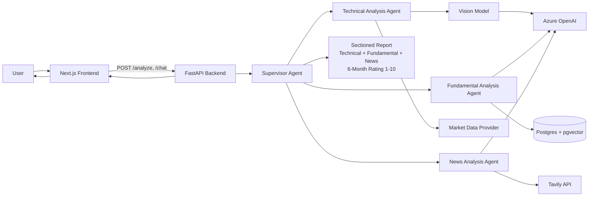
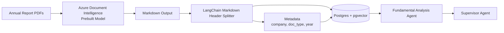

# Architecture

This document separates architecture into:
- Runtime analysis flow (`/analyze`, `/chat`)
- Document ingestion flow (PDF to vector store)

## Runtime Flow

## Document Ingestion Flow

## Notes
- `Technical Analysis Agent` and `News Analysis Agent` are implemented.
- `Fundamental Analysis Agent` and `Supervisor Agent` are planned/in progress.
- Notebook-based prototyping (`notebooks/agent_playground.ipynb`) validates sub-agents before full API integration.
