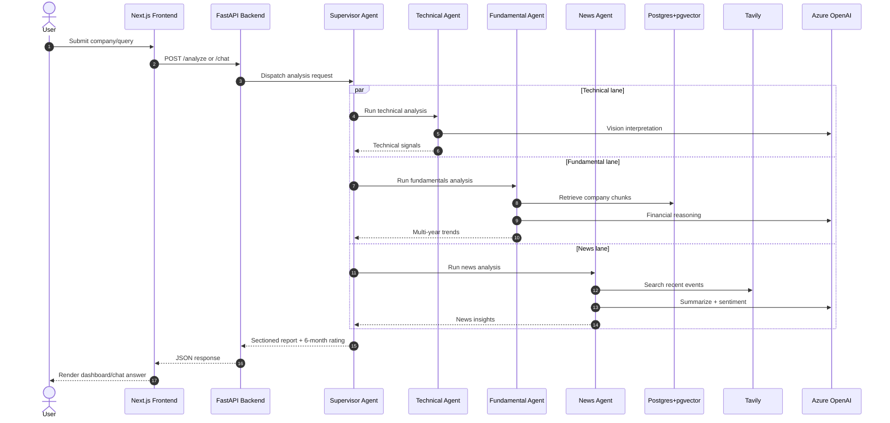
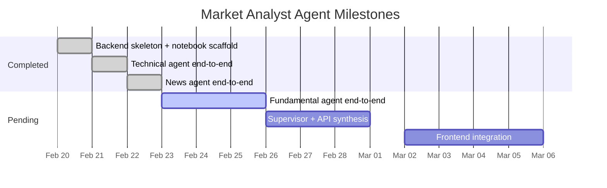
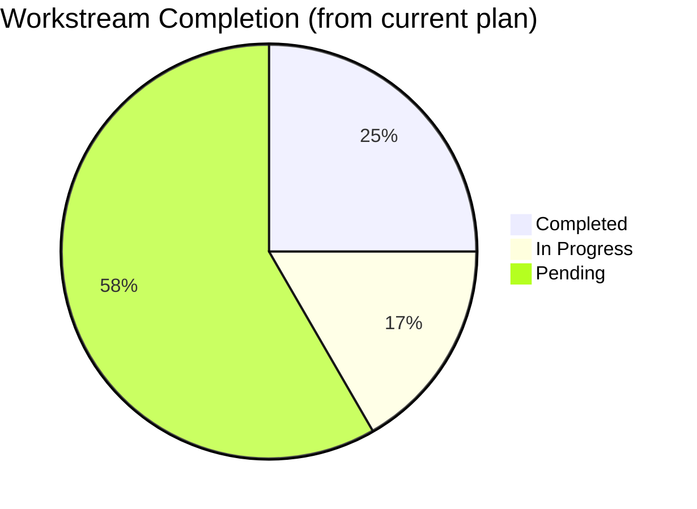

# Chart Diagrams

Mermaid chart diagrams based on `plan.md` and the architecture definition.

## 1. Runtime Execution Sequence

## 2. Project Milestone Timeline

## 3. Workstream Completion Snapshot

